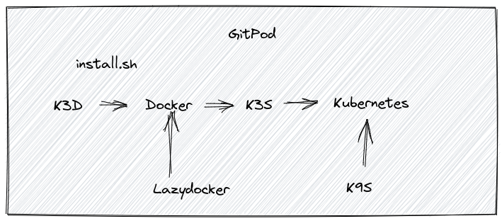

# k3d-demo

1. `gp init` ausführen
2. K3D installieren

```bash
curl -s https://raw.githubusercontent.com/k3d-io/k3d/main/install.sh | bash
```

3. Cluster anlegen

```bash
k3d cluster create demo
```

4. Kubectl im Workspace anlegen

```bash
sudo curl -L "https://dl.k8s.io/release/$(curl -L -s https://dl.k8s.io/release/stable.txt)/bin/linux/amd64/kubectl" -o /usr/local/bin/kubectl
sudo chmod +x /usr/local/bin/kubectl
```

5. K9S installieren

```bash
brew install derailed/k9s/k9s
```

6. Lazydocker installieren

```bash
brew install jesseduffield/lazydocker/lazydocker
```

7. Log des Container anschauen

In dem Container Log sieht man die Fehlermeldung **could not open /dev/kmsg**.

